# ** Please send email to info@nunomo.net , or open issues for inquiries. **


# Qun-synthesizer

Qun-synthesizer is an analog modeling synthesizer engine for ESP32-LyraT that works with Nunomo's daughter board.


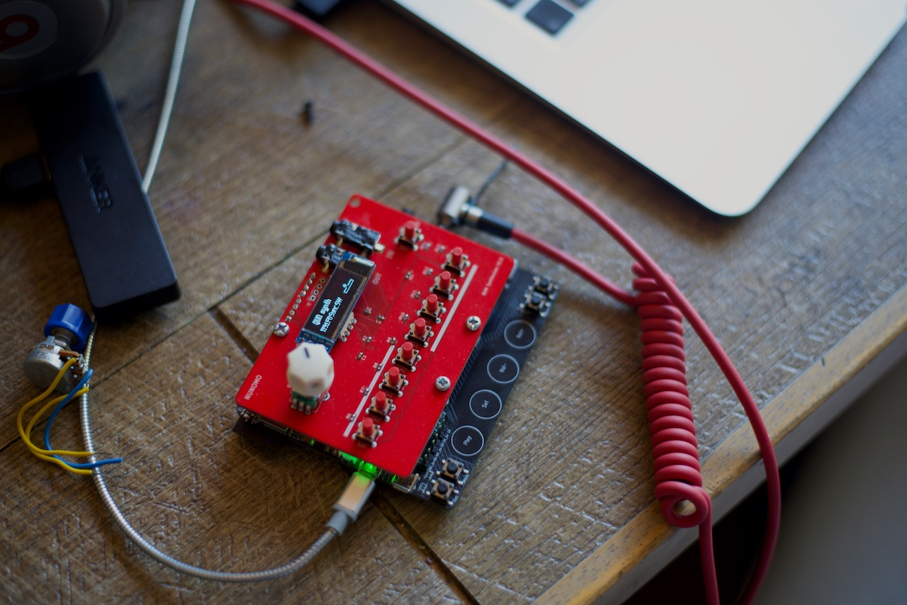


## Links and Information

* [Online Shop](https://shop.nunomo.net/products/qun-pocket-synthesizer): Purchase your own QUN from our website.

* [Wiki](https://github.com/raspy135/Qun-synthesizer/wiki) for ideas and tips.

* [Patches](./patches) for tone patches.

* [Configurations](./configurations) for files to use with third-party software and hardware such as Native Instruments Maschine.

* [Issues](https://github.com/raspy135/Qun-synthesizer/issues): Report issues when you have problems or questions.

* [Firmware](https://github.com/raspy135/Qun-synthesizer/tree/master/firmware): For firmware updates.

**We are looking for pull requests for patches, we will add them to this repository.**

**We are looking for your feedback! For general impressions and feedback, please email them to info@nunomo.net.**

## Overview of the QUN synth
The ESP32-LyraT was originally designed for use in smart speakers. QUN synthesizer successfully uses it to achieve affordable pricing as a synthesizer. Though since the ESP32-LyraT is not designed to be a synthesizer, it has some limitations, e.g. it has USB, but it's not typical USB-MIDI, it's MIDI UART.

* **Analog Modeling engine**
  * The analog modeling engine is **an original, made from scratch**. It uses advanced algorithms for great organic sound. The engine is not a copy of a classic synth, it is designed to make modern sounds.
  * It utilizes every single clock of ESP32's CPU power.
  * Ultra low latency ~< 1ms (sound latency, total latency varies by connection type), the low latency can be achieved because it does only sound processing, it doesn't need extra buffer for unexpected CPU use like a PC.
  * All analog modeling engine parameters can be configured through MIDI. 
  * Clean 2 Oscillators. Cheap synthesizers compromise this part sometimes, but QUN has no-alias noise Oscillators. All of the internal calculation is done by floating point for the sound quality.
  * Oscillators can be used as dual tone. 
  * Multiple QUN synths can be stacked to achieve a **Polyphonic** setup. 
  * **Ultra Flexible MOD (CV) routing**. The signal routing is very flexible, close to modular synthesizer experience. You can route signals as normal, or totally radical.
  * 1 (2 channels with changing the ESP32-LyraT circuit) AUX(R/L) input can be used for **external audio signal**, or **external CV inputs**
  * 4 Envelope Generators
  * FM (4 Operators x 2)
  * **Granular / Sampler engine**
  * 1 LFO, rate can be controlled by MIDI notes
  * 1 Organic sounding VCF
    * 2/4 Poles, Low-pass, Band-pass, High-pass, Notch)
    * **Organic linear and classic non-linear**
    * Key sync
  * 1 Effect (Delay, Chorus, Flanger)
  * MIDI clock sync
  * **3 advanced clipping algorithms** gives an organic clipping sound
* Player / Sequencer
  * Player (piano mode)
  * Random 8-step sequencer will generate inspiring beats for you
    * Note On/Off/Double/Triple
    * Transpose / Note width (Length)
    * Randomness control
    * Scale quantize
    * Arpeggiate steps
  * Looper
    * Looper can record the sound up to 30 sec, synchronized with the sequencer.
    * **3 tracks**
    * Cut / Paste
    * Play / Rec / Overdub
  * Mixer
  	* Looper tracks can be panned for stereo
  	* Routing looper mixout to sound engine (AUX L)

## CONNECTIONS

* Power: Use a good quality USB power supply. Connect the USB cable to `POWER` labeled USB port.
* BLE MIDI: iOS and macOS are supported. Windows is NOT supported. BLE MIDI has 15 to 20ms latency in general, it is a limitation of the BLE spec. For lower latency, use MIDI or MIDI UART.
* MIDI: Use **TRS A** MIDI adapter to connect MIDI cables. TRS A type adapter is the same as KORG, AKAI and Make Noise's adapter.
* MIDI UART: You can use MIDI UART instead of traditional MIDI interface. It requires a special program and MIDI bridges (e.g. LoopMIDI in Windows, IAC for macOS) but once you set them up then you can use it like USB-MIDI. Connect the ESP32-LyraT's `UART` labeled USB to your computer. You may need to install a UART driver (https://www.silabs.com/products/development-tools/software/usb-to-uart-bridge-vcp-drivers)
	* For detail of MIDI UART, please refer https://github.com/raspy135/serialmidi project. Set baud rate to MIDI's traditional 31250bps.
* The synthesizer can process external audio signals, it also has microphones.
* LINE IN and PHONE OUT is located at right side. The sound engine is mono, but looper mixer is stereo. **Please use a stereo cable for the sound output**.

## MAJOR MODES

 The synth has three major modes, it can be changed by pressing ESP32-LyraT's three touch buttons. Parameter mode is the main mode of the synthesizer:
l
Button | Function
------------ | -------------
Play | Play Mode. It’s for sequencer.
Set | Setting. For load / save / system setting.
Vol+ | Parameter Mode. Change synthesizer’s parameters.
Vol- | N/A. The button is disabled by hardware.
RST | Reset the board.
Boot | Only used for updating the firmware. Find out more [here](https://github.com/raspy135/Qun-synthesizer/blob/master/firmware/README.md).


## BASIC OPERATION

Each major mode has sub modes. Select sub mode. For example, `OSC1` is a sub mode for Oscillator 1.
* To switch sub mode, press Mode button (on the top board) + rotate dial. Keep pressing Mode button while you are selecting sub mode.


* Alternatively, if you press Mode button and release it, sticky mode button is activated. Help will be shown. If you press one of 8 buttons or press "Rec" or "Mode" on the base board,this will change Sub mode in the Major mode. For example in Parameter mode, press Mode button, then press button 2 (second button of the 8 buttons) will switch to OSC2 sub mode. If you press Mode and "Rec" in the base board, "FM Conf" mode will be selected.
This offers a quicker way to access the sub mode once you remember the position.

After you enter the sub mode you want, then next you need to select and change the parameter.
* Press one of 8 buttons + rotate dial = Change parameter
If you just press one of 8 buttons and release, then it indicates the current value of the parameter.
Once you selected the parameter, the parameter is assigned to the dial.
* Rotate the dial = Change the current parameter.

 

* Sometimes fine adjustment is hard. In this case, you can use "Rec" and "Mode" button to change the value by 1. To do this, keep pressing one of 8 buttons and press "Rec" for decrease, "Mode" for increase.

* Some parameters will perform an action just by pressing the button, e.g. loading a preset.

### Dumping current preset
When you are not in Play mode, all tone configuration can be specified as sort of MIDI CC signals. Pressing “REC” button will dump all configuration.
If you record the MIDI signals to your MIDI recorder or DAW, it can be used as a tone preset.

### All notes off
When you are not in Play mode, pressing “Mode” button on the base board (not the red top board) will turn on / turn off receiving MIDI signal. It can be used as a MIDI Panic button. 

### MIDI learning

Assigning proper MIDI CC to your MIDI keyboard is recommended for frequently used parameters, however, you can override MIDI CC temporary by the following operation:

1. In parameter mode, press corresponding MIDI CC button long time (about 3 sec). For example, OSC1's Pulse Width is button 2 in OSC1 sub mode.
2. Then "MIDI Learning" message is shown. Keep pressing the button.
3. Send MIDI CC signal from your MIDI keyboard (Turn the knob or move fader). The sent MIDI CC# will control the assigned parameter.

Once the parameter is assigned, then "*" mark is indicated before the CC number. Original CC assignment is still working. It won't be affected with MIDI dumping.
MIDI learning will take any MIDI channel. For example, even if you set the device to receive MIDI channel 2, MIDI learning can receive CC# for channel 3, or any other channels.

To cancel the override, do the same operation again.

To avoid confusion, this setting won't be saved, but still useful for temporary control.

## Parameter sheet / Guide sheet

PDF and PNG versions are available.
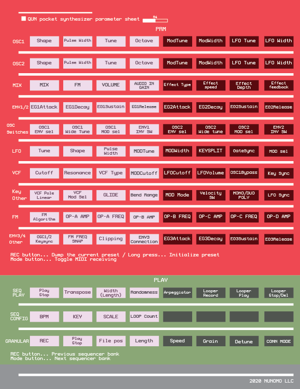
./manual_images/qun_cheat_sheet.pdf

Guide sheet might be useful as well.
PDF version is ./manual_images/guide_sheet.pdf

Please print the PDF and put it on your QUN synth. 
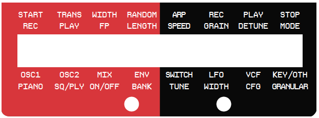


## Parameter Mode

### PRM:OSCILLATOR1,2
This diagram shows OSC1 and OSC2 features. The diagram is for explanation, it may not cover all features in the OSCs. Unlike most hardware synths, all parameters can be controlled via MIDI including dials.

**Blue: Sources | Green: Output**
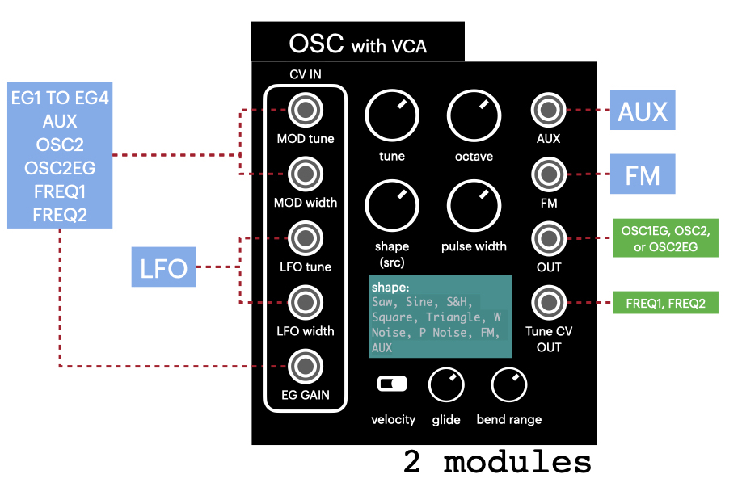

The oscillator is a hybrid of classic analog synth and FM. FM has its own parameters, it can be configured in FM conf / ENV3/4 Other Mode.

The QUN's CV input routing is very flexible. One CV is connected to LFO (for tune/width), another one is selectable. It could be one of EG1 to EG4, AUX (Audio in), OSC2 signal, OSC2 signal after EG processing, Freq level out from OSC1, or Freq level out from OSC2.

1. SHAPE

	`Saw, Sine, S&H, Square, Triangle, W Noise, P Noise, FM, AUX`
	*AUX means audio input from LINE or MIC.
	*FM has 4 operators inside. See FM Conf Sub mode for detail.
	*Granular synth engine can be connected to AUX L channel. See Granular sub mode for detail.

2. PULSE WIDTH
	
	The synth has an unique behavior with pulse width.
	You can modulate the wave shape by pulse width, not only limited to Square wave.
	
	* Triangle
	* SAW
* Square
	
3. TUNE

4. OCTAVE

5. MOD TUNE

	MOD bus feedback to tune.

6. MOD WIDTH

	MOD bus feedback to pulse width.

7. LFO TUNE

	LFO feedback to tune.

8. LFO WIDTH

	LFO feedback to pulse width.

### PRM:MIX
Mix controls mixer and effects.

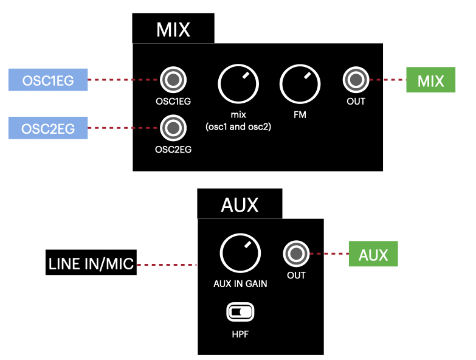

1. OSC MIX

	Balance between OSC1 and OSC2

2. FM

	FM modulation OSC2 to OSC1. 
	That means that each oscillator has internal 4 operator FM, on top of it, you can modulate OSC1 by OSC2.

3. VCF VOLUME

	Volume to VCF. It can be used as generic volume control.

4. AUDIO IN GAIN

	GAIN from Line in / Mic In

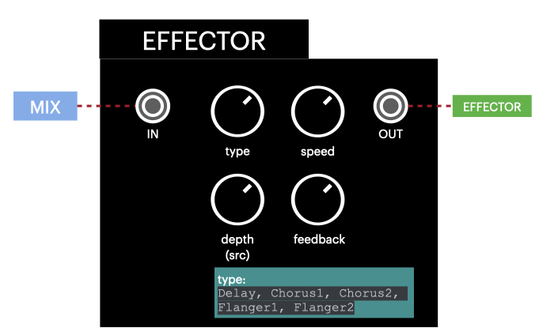

5. EFFECT TYPE

	Delay, Chorus1, Chorus2, Flanger1, Flanger2

6. EFFECT SPEED

	Controls Effect LFO rate

7. EFFECT DEPTH

	Amount of effect

8. EFFECT FEEDBACK

	Feedback for Delay

The Delay can be set very short. Very short delay can be used to create an interesting simulation of flute or violin. 

### PRM:ENV1/2
The synth has four Envelope generators. ENV1 and ENV2 are both independently and fully configurable. ENV3 and ENV4 shares the parameter. Also ENV3 / ENV4 is connected to FM operators.
ENV1 and ENV2 are grouped to first voice with Duo mode. ENV3 and ENV4 are grouped to second voice with Duo mode.

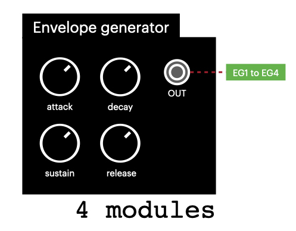

1/5 . ATTACK

	Attack time

2/6 . DECAY

	Decay time

3/7 . SUSTAIN

	Sustain level

4/8 . RELEASE

	Release time

### PRM:OSC Switches
OSC has many switches to change its behavior.

1/5 . ENV Sel

	Selects Envelope(VCA) for the oscillator.
	`EG1, EG2, EG3, EG4, AUX, OSC2, OSC2EG, FRQ1, FRQ2, ON`
2/6 . WIDE TUNE

	When it is ON, you can tune wider range by OSC’s tune parameter.
3/7 . MOD SEL

	Select Mod signal source. It is connected to OSC's tune or width.
	`EG1, EG2, EG3, EG4, AUX, OSC2, OSC2EG, FRQ1, FRQ2, ON`

4/8 . ENV INV SW

	It inverts Envelope Generator’s polarity. ENV1 and ENV2 can change its polarity.

### PRM:LFO
LFO is similar to OSC, although selectable shape is slightly different.

External clock sync setting is available in "PRM:KEY/OTHER" menu.

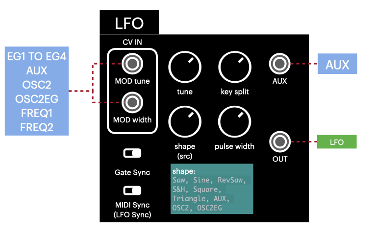

1. LFO TUNE

	Tune

2. LFO SHAPE

	`Saw, Sine, RevSaw, S&H, Square, Triangle, AUX, OSC2, OSC2EG`
	*AUX is audio input from LINE / MIC.
	*You can use OSC2 as LFO source. You can even modulate OSC2 with OSC2.
	*OSC2EG is the signal from OSC after Envelope Generator processing.

3. LFO PULSE WIDTH

	Pulse width

4. LFO MOD TUNE

	Envelope generator feedback to tune.

5. LFO MOD WIDTH

	Envelope generator feedback to pulse width.

6. KEYSPLIT

	This is a unique feature of the synth.
	When it is not zero, then note number above the parameter becomes LFO rate controller. If you set 60, then C4 or higher note becomes LFO controller.
	Higher notes will generate higher LFO rate.
	If you press multiple notes, it doubles and triples the rate, great for live performance.

7. LFO GATESYNC

	LFO’s phase is reset by every note hit when it is ON.

8. LFO MOD SEL

	`EG1, EG2, EG3, EG4, AUX, OSC2, OSC2EG, FRQ1, FRQ2`

### PRM:VCF
The synth has one filter. LPF / BPF/ HPF / Notch can be selected. It also has a 4/2 poles switch, and linear and non-linear switch. Linear gives organic resonance, Non-linear gives more character.

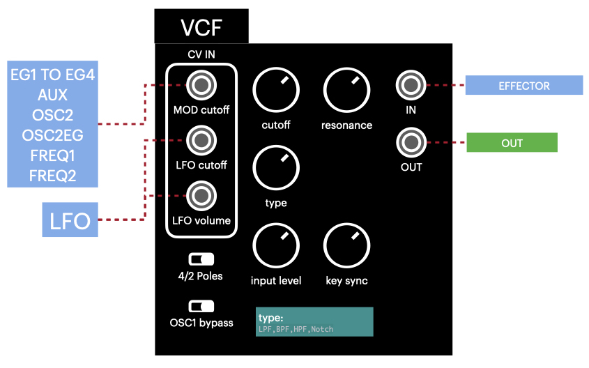

1. CUTOFF

	Set the cutoff frequency.

2. RESONANCE

	Resonance.

3. VCF TYPE

	`LPF,BPF,HPF,Notch`.

4. VCF MOD CUTOFF

	Mod feedback to cutoff. Mod source selection is located in `Prm:Key / Other` sub mode.

5. VCF LFO CUTOFF

	LFO to cutoff feedback.

6. VCF LFO Volume

	LFO feedback to VCF’s input volume.

7. Wave folding

  When it is on, aggressive clipping curve (wave folding) is applied.

  It works better with simple wave shape such as sine wave.

  Purple : Agreesive asymmetricaltric curve

  Blue : Aggressive symmetric curve

  Green : Medium symmetric curve

  Red : Gentle symmetric curve

8. VCF KEY SYNC

	When it is not zero, VCF’s cutoff will follows the playing note. Higher value is more sensitive.
	Great with Mono, but not working well with Duo tone because it has only one VCF.

### PRM:KEY/OTHER
Configures other parameters.

1. VCF 4/2 POLE / NoLinear

	Change filter's number of poles, and selects linear or non-linear. 2 Poles is -12db/oct, 4 Poles is -24db/oct. 2 Poles filter gives brighter character. Linear(LI) has less character, but linear's resonance is sharp and more organic like real instruments. Non-linear(NL) has more character, has more harmonics, close to other synthesizers. 
	If you use cutoff envelope or copying patch from other synths, typically Non-linear is suitable.
	If you are trying to achieve something close to a real instrument or you want clear sound, linear is suitable.

2. VCF MOD SEL

	`EG1, EG2, EG3, EG4, AUX, OSC2, OSC2EG, FRQ1, FRQ2, ON`.

3. GLIDE

	Tune changes gradient when the value is not zero. Works with Mono.

4. BEND RANGE

	Pitch bend range.

5. OSC1/2 Keysync

	This is a switch to connect MIDI input note and oscillators. Y = Follow MIDI note pitch. N =Ignore MIDI note pitch. This is useful when you make percussion sound.
    You can still use freq1 freq2 for modulation to use MIDI note pitch.

6. VELOCITY SW

	Envelope generators become velocity sensitive when it’s ON.

7. MONO/DUO/POLY

	One synthesizer can be used as Monophonic or Duophonic.
	
	* Mono = Mono (2 OSCs per voice)
	* Duo = Duo Tone (1 OSC per voice)
	
    (From firmware 2.10) When the mode is Duo or Poly Duo, MIX  and "OSC2 Env Sel" are ignored. MIX is always set to middle, and OSC2 Env Sel is always set to EG2.
    Most of cases you want to use the same parameters between Osc1 and Osc2 with Duo mode. To copy the parameter from OSC1 to OSC2 (and EG1 and EG2), long press button 7. "OSCs synched" message will be shown. 
	
	Here is an example to set up Duo mode
	1. Initialize tone.
    2. Configure OSC1 as you like.
	3. Set this parameter to "Duo" mode by pressing button 7.
    4. If you want to copy OSC1 parameters to OSC2, in the same submode, long press button 7 until "OSCs synched" message shown.
	5. Play two notes by external MIDI keyboard. You will hear two voices.
	

    Poly Mono and Poly Duo is for multiple device stacked configuration. You can use multiple Qun Synthesizers to build polyphonic synth.
	Please see “Polyphonic setup” for detail.

8. LFO SYNC SW

	LFO rate will synchronize with MIDI clock when it is ON.

### PRM:FM CONF
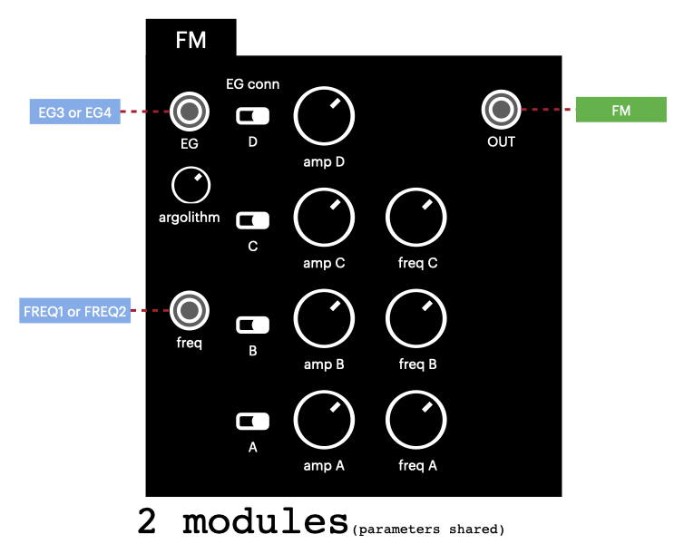

The synth has 2 x 4 operator FM engine. OSC1 or OSC2 can be set to FM mode.
Each operator has sine wave.
OSC1 and OSC2 share the FM parameter.
On top of two FM engines, you can do FM modulation between oscillators.

1. FM ALGORITHM

	Selects FM algorithm. "ABCD" indicates each operator.
	Vertical relationship means upper operator modulates lower operator.
	For example,
```
	    A
	B C D
```
	This means that operator A modulates operator D. B, C and modulated D will be mixed in parallel.
```
	A
	B
	C
	D
```
	This means A modulates B, the result modulates C, the result modulates D.

2/4/6/8. FM (ABCD) AMP

	Oscillator (ABCD)’s amplitude.

3/5/7. FM (ABC) FREQ

	Oscillator (ABC)’s frequency (multiple of frequency of D)
	When FM FREQ SNAP (In ENV3/4 Other sub-menu) is off, it be adjust to the exact frequency of harmonics (2,3,4,5..). If you want clean FM sound, turn FM FREQ SNAP on.

### PRM:ENV3/4 / Other

1. 2ND FILTER

  Second filter can be used when you use 2 pole filter for VCF.

  Mode | 
------------ | -------------
NC200 | Notch filter at 200Hz. It will remove some muddy.
NC1K | Notch filter at 1kHz. It will remove some highs.
LS100 | Low-shelf at 100Hz. It will boot bass without cutting high.
LS150 | Low-shelf at 150Hz. It will boot bass without cutting high.
LS200 | Low-shelf at 200Hz. It will boot bass without cutting high.
LS300 | Low-shelf at 300Hz. It will boot bass without cutting high.
HP80 | Highpass at 80Hz. It will remove low-end bass to get more clear sound.
LP4K | Lowpass at 4kHz. It will remove high-end.
PK100 | Peak filter at 100Hz. Similar to band-pass filter, but Peak filter boots the peak frequency but it will not cut other frequency like band-pass filter.
PK150 | Peak filter at 150Hz.
PK200 | Peak filter at 200Hz.
PK300 | Peak filter at 300Hz.
PK400 | Peak filter at 400Hz.
PK800 | Peak filter at 800Hz.


2. FM FREQ SNAP SW

	Frequency snapping for FM. When it's ON, FM sound will be clear, no detune.
	When it's OFF, FM has more character, the signature sound of the QUN synth.

3. Clipping

	Clipping algorithm. "GRAIN", "MID" or "SOFT". The clipping algorithm will give a good distortion sound, you can even use the synth as multi-effector. See "External Audio processing" for further details.

4. FM ENV3 CONN

	Select operator(s) to connect ENV3
		FM engine's operators can use Envelope generator (ENV3/ENV4).
	Part of Operators can be connected to ENV3. The connection is configurable by this parameter.
	Technically ENV4 exists for OSC2’s FM engine, but the parameter is shared with ENV3.
	After the processing it will be modulated by ENV1 or ENV2.

5. ENV3/4 ATTACK

6. ENV3/4 DECAY

7. ENV3/4 SUSTAIN

8. ENV3/4 RELEASE

## PLAY MODE

In Play mode, you can use piano key and sequencer. Piano key is mainly just for checking tone. Sequencer is more practical. The sequencer is an 8-step sequencer, but each step can have double note, second half note or triple note, thus it is more than a normal 8-step sequencer. Also you can connect sequencer banks up to 4 banks = 32 steps.

**Since v1.60 firmware, the sequencer data is paired with tone preset.** Sequencer data will be saved when you save tone preset. Each preset can have 8 sequencer banks.

In Play mode, sequence bank number (1-8) and looper track number (A-D) are indicated.

The sequencer has 8 banks (patterns). Bank can be switched in Seq Bank mode, or **pressing "Rec / Mode" key on the ESP32-LyraT board**.

The looper has 3 tracks. Track can be switched in Seq Play mode.

The sequencer also has Looper. You can record and overdub played notes.

### PLY:PLAY PIANO
The mode is simple piano playing mode. Scale will be determined by the scale setting. Useful to check the sound. This is probably not useful for live performance. The sequencer is more practical for live performance, though you can just use an external sequencer or DAW.

### PLY:SEQ PLAY
This is main page of sequencer control mode.
Some buttons will perform an action just by pressing the button, without rotating the dial.

Button | Function
------------ | -------------
1 | Play/Stop the sequencer.
2 | Transpose.
3 | Width Offset (note length). / Long press for playing Pattern shuffle
4 | Note Randomness / Long press for looper track cut.
5 | Arpeggiator /  Long press for looper track paste.
6 | Looper Record / Overdub for the current track
7 | Play looper / Toggle recording track (A,B or C) when playing 
8 | Stop looper / Toggle recording track (A,B, or C) when not playing / **Long press to delete whole recording.** 


This sub mode has a lot of features to play sequencer with fun.
Transpose, Width Offset, Pattern shuffle, Randomness, Arpeggiator are pattern modifier. It will be applied to current pattern without breaking the pattern.

- Transpose will add offset to the pattern. Scale quantize (SEQ Config button 3) will help to keep the result musical.
- Width Offset will change the note length.
- Randomness will add some randomness to playing notes.  Scale quantize (SEQ Config button 3) will help to keep the result musical.
- Arpeggiator will add note offset. Scale quantize (SEQ Config button 3) is important to generate usable Arpeggiator result.
- Pattern Shuffle will shuffle the playing order of the pattern.

This sub mode also controls sequencer synchronized looper.
To start pattern recording, hit Overdub button (button 6) first, then start the sequencer (button 1). Press stop (button 8) when you finished the recording.
Looper keeps playing the recorded sound.


Looper has 3 tracks.Pressing Play or Stop to switch current track.

Reduce record volume (-6.0dB or more) in Mixer to avoid clipping.
The first recording will determine the length of the recording, this cannot be changed later. Cut / Paste is supported. Cut / Paste can be used for temporary saved area or delete the track.
Recorded data cannot be saved.

Each track can record up to about 30 seconds, however, the synth doesn't have enough memory for 3 tracks when the loop length is long. In case the device doesn't have more memory, it will emit "No Memory" error.

### PLY:SEQ ON/OFF
The sequencer has 8 steps, but it has more modes than ON/OFF.
You can set different type of notes by turning dial while you press the button.

Status | Meaning
------------ | -------------
Left-filled circle | One note in the step.
Right-filled circle | One note in the step but it plays at the second half.
Fully-filled circle | Two notes in the step (1/16th).
Striped circle | 3 notes in the step (triplet).

### PLY:SEQ BANK
The sequencer has 8 banks, you can switch the bank while playing.

You can start or stop sequencer by long pressing one of 8 buttons.

Button 1 to 8: Change bank 1 to 8

Pressing Button 1 to 8 and changing dial: Copy bank to other bank. It's useful when you want to make a new bank by using existing data. If you want to cancel the operation, turn to the end, then "CANCEL" will be indicated as the destination. To initialize the bank data, turn the dial to "CLEAR".

It is useful to keep one bank is blank, it can be used as mute.

### PLY:SEQ TUNE
Press one of the eight buttons and turn the dial, then it will modify tune offset for each step.

"Result:" shows the final playing note. (There are many parameters will affect the final playing note such as scale quantize, key and transpose. Sometimes it's hard to guess the final playing note. )

Alternatevely, you can step record notes by external MIDI keyboard. Play note by MIDI keyboard while you are pressing one of the eight buttons, the note will be recorded as the tune for the step.
https://www.youtube.com/watch?v=aV2YL0idMHA

### PLY:SEQ WIDTH
Press one of the eight buttons and turn the dial, then it will modify width (note length) offset for each step. If the width is long enough to touch next step note, it becomes ties or slurs. The note will not be retriggered.

### PLY:SEQ CONFIG

Button | Function
------------ | -------------
1 | BPM / SWING. Long pressing the button for Swing. 
2 | Key (for scale).
3 | Scale. Playing note will be quantized by this scale.
4 | Sequencer loop count. Default is 8. You can set more than 8 steps. the steps is more than 8, next bank will be connected when playing. For example, if you set 16 on bank 1, bank 1 and bank 2 are connected. 
5 | BPM factor. Playing speed can be double or half.
6 | Velocity period (steps). You can play different velocity notes. Make sure you set Velocity Period Volume parameter and Velocity SW is ON
7 | Velocity Period Volume for off-beat note.
8 | Velocity Period Offset

## Ply: Granular

### Overview

Since firmware v1.4, the Qun synth features a Granular synthesis recorder.
- Once you finish the editing, you can connect the Granular engine's output to AUX L channel. It means **Granular engine can be used as one of Oscillator shape**. You can assign Granular engine to Oscillator 1, and you still have Oscillator 2.
- You can record audio from LINE IN or MIC. Input sensitivity can be modified by "AUX In Gain" parameter.
- The engine is basically influenced by Granular synthesis, but the implementation is somewhat unusual.
- Pulse Width modulation will change File position (starting position) of the audio. That means the File position can be modulated by LFO and others.
- 4 Modes are available. **One shot, One shot with time stretch, Repeat, Repeat with time stretch**. When you are in One shot mode and play note slur, then the playing position won't be reset. 
- With Repeat mode, you can route the signal to OSC1 AUX L only.
- With One shot mode, you can route the signal to OSC1 AUX L and OSC2 AUX L. 
- You can save up to 4 slots of recorded audio data. When you use Preset 0-3 for save, audio data will be saved.
- Parameters can be controlled via MIDI CC. See the parameter start with GRN.
- With initialized state of oscillator, C4 is the original pitch of the audio.

This is a simple setup to use the granular engine:

1. Move to Granular sub mode, and record audio.
2. Adjust parameters in Granular mode
3. Change GRN mode from OFF to something else. It overrides AUX L channel to Granular engine's output.
4. Go Oscillator parameter page, and select OSC shape to "AUX L"
5. Play notes

### Operation

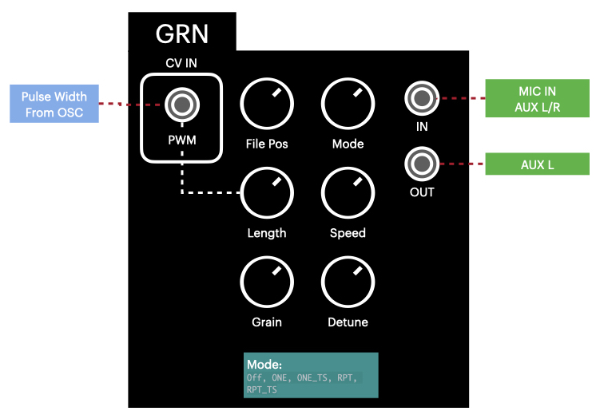


Button | Function
------------ | -------------
1 | Record audio. After the recording, audio data is analyzed.
2 | Play / Stop audio.
3 | File position (Starting point).
4 | Length
5 | Speed. It won't work with non-time stretch modes.
6 | Number of Grain. It won't work with One-shot modes.
7 | Detune. (Octave highs and lows)
8 | GRN Mode. OFF, ONE(One shot), ONE_TS(One shot with time stretch), RPT(Repeat), RPT_TS(Repeat with time stretch). When the mode is not OFF, It will override AUX L signal to granular output when you use AUX L as Oscillator shape. With time stretch, playing speed will be preserved. Without it, pitch and speed are linked like an analog tape.

### Granular synth tips

- Play note slur with One-shot mode. It works very well. You can keep the tempo with One shot with time stretch mode.
- Glide parameter is fun parameter with Granular.
- Speed can go negative.
- If you slice the audio to very short range with Repeat mode, the wave shape could be very simple and generic.
- With Repeat mode, set length to about 0.5 sec and changing Pulse Width makes unique sound.

### PLY:MIXER

It is a mixer after in the looper. Record volume can be used as final stage volume from the sound engine. At the last stage, signal can be **stereo** by panning tracks.

Button | Function
------------ | -------------
1 | Track A volume / Long press for Pan
2 | Track B volume / Long press for Pan
3 | Track C volume / Long press for Pan
4 | Track A mute
5 | Track B mute
6 | Track C mute
7 | Record volume (After the clipper)
8 | Looper mixout routes to AUX L

You can route looper mixout to AUX L. When it is routed to AUX L, Looper output is turned off. By the following configuration, you can hear the output from looper and apply effects and filters.

1. When playing the looper, press button 8. Mixout routes to AUX L. Playing sound will be stopped. (The signal goes AUX L, not the synth's output)
2. Set OSC 1 signal to AUX L
3. OSC1 Env Sel to "ON". You will hear the looper sound again.
4. Apply effects and filter


The processed signal can be recorded. For example, the following operation adds delay to track A.


3. Let's say track A has a recorded data. Mute all tracks except A. Set record volume to 0dB(Maximum) to keep volume.

4. Play looper.

5. Looper mixout routes to AUX L (It becomes silence)

6. Initialize the tone (Long press Rec button)

7. Set OSC 1 signal to AUX L

8. OSC1 Env Sel to "ON"

9. Add delay

10. Select Track B on Looper

11. Play sequencer with silent pattern (for better timing) and Perform Overdub. Track A sound with delay is recorded to track B.


## SETTING MODE


### SET:LOAD(Bank 1 to 4)

Load from the saved preset.
Pressing button 1 to 8 will load preset 1 to 8. It has 4 banks for user, and 4 banks for factory preset.
To switch between user and factory banks, press "Rec" button at the bottom of the board.
Factory preset is a new feature that comes with after 2022 purchase. If factory presets are not available, you need to install factory preset. See firmware README for detail.

In bank 1, first 4 slots (Preset 0 to 3) are special. It can store audio data in Granular.


### SET:SAVE(Bank 1 to 4)
Save current parameters to the preset.
Pressing button 1 to 8 will save to preset 1 to 8. It has 4 banks.
Preset 0 to 3 is special, it saves audio data in Granular. 

When you press one of 8 buttons, it will as for preset name. Use button 1-6 for text position, turn dial to select letter. button 7 is for cancel, button 8 is for save.


### SET:SYSTEM
System Setting is the setting that is not included in the patch setting. To change the parameter, press the one of 8 buttons and rotate the dial.

AUX: Audio source select. It's the ESP32-LyraT's microphone, the microphone is not high quality. Mic (the board has two onboard microphones) or Line in. It will be stored in the flash memory. When you use LINE IN, set this setting to "LINE IN(2CH)".

Number of devices: Number of devices for poly mode. Set 1 if you don’t have multiple devices. It will be stored in the flash memory.

Device Index: Device Index. Set 1 if you don’t have multiple devices. It will be stored in the flash memory.

RECV MIDI Ch: Configure receiving MIDI channel. Default is ALL. If you use it with Polyphonic setup, set the same channel or ALL for all devices.

MIDI Forwarding: MIDI message forwarding for standalone polyphonic configuration. When the option is ON, the message forwarding is active with PolyMono or PolyDuo configuration. It's not for generic MIDI forwarding like MIDI THRU. Do not turn this option with DAW configuration. Most of DAW will echo received MIDI message, it will cause an infinite MIDI message loop. 

LINE in THRU: If it is off, it is automatically turn on or off LINE IN pass through by mono / poly setting. If it is on, the synth always passes the signal. This setting will be stored in the flash memory. It only takes Right channel. Gain is fixed to 1.

LINE in HPF: On is default. LINE in has two HPFs, one is external, one is internal HPF in the chip. This setting turns internal HPF. Turning this off will reduce HPF effect.

Sync Mode: `STOP, MIDI, 2PPQ, 4PPQ, 24PPQ`. Select clock source for sequencer and LFO. See `Clock synchronization` for detail. This could cause some confusion so this setting will not be saved to flash memory.

## POLYPHONIC SETUP
The synth can be used as Mono or Duo tone if you have more than one device.
The voice number can be increased up to 8 (with Duo mode), by stacking up the synths.

_Tested well with two devices, using more than 2 devices is experimental at this stage._

### Audio connection

There are two ways for audio setup:

1. Connect Slave's audio out to Master's Line IN to combine outputs.
2. Connect all audio signals to your mixer.

### MIDI connection

Use TRS cable to connect Master's MIDI out to Slave's MIDI IN.

Turn on MIDI Forwarding in System menu. All received MIDI signal will be forwarded to Slave device. This is more reliable than DAW setup since it's not relying on DAW's MIDI routing, but you will lose MIDI out function to DAW. (You may still be able to use Slave's MIDI out though)

Please make sure you turn off MIDI forwarding when you connect MIDI OUT to DAW next time. Normally DAW echoes the received MIDI packet, so MIDI forwarding setting will cause MIDI message flood.

### Preset setup for Polyphonic

Minimum setup to achieve PolyMono (2 Oscillators per voice) will be the following with 2 devices setup:

1. In System menu, "Num of devices" should be 2 for all devices. Set Dev Index=1 for Master device, 2 for Slave device. This will be saved to flash memory.
2. Initialize a preset (4 second press of Rec button) on Master device.
3. Make sure it plays initial SAW wave sound.
4. Go Key / Other sub-menu and set MonoDuoPolyMode to "PolyMono"
5. Press "Rec" button on Master device. It will dump all preset parameters as MIDI CC messages. After the dump, all preset state should be in sync between devices.
6. Play multiple notes. You should hear two voices.

Minimum setup to achieve PolyDuo (1 Oscillator per voice) will be the following with 2 devices setup:

1. In System menu, "Num of devices" should be 2 for all devices. Set Dev Index=1 for Master device, 2 for Slave device.
2. Initialize a preset (4 second press of Rec button) on Master device.
3. Make sure it can play initial SAW wave sound.
4. Go Key / Other sub-menu and set MonoDuoPolyMode to "PolyDuo"
5. Press "Rec" button on Master device. It will dump all preset commands. After the dump, all preset state should be in sync between devices.
6. Play multiple notes. You should hear four voices.

### Polyphonic tips

Two devices can lose sync for a variety of reasons.
To synchronize all parameters one more time, press “Rec” button to dump all parameters. It will be sent to slave devices. If you still see issues like out of tune in slave device, try MIDI RECV toggle switch (ESP32-LyraT's "Mode" button, next to Rec button). It will reset pitch bend or other controller values.

If it starts making ground loop noise, use separated power supply and use standalone setup or use separated MIDI cable to avoid MIDI signal noise.


## TIPS/TROUBLESHOOTING

* Sound engine stopped when saving preset
  * When system writes to flash memory, CPU power is taken by this, and it may cause glitches. Avoid writing to flash while playing.

* MIDI CC dump is not properly saved to my DAW	
	* Some DAWs, such as Ableton Live, suppress MIDI CC messages when DAW believes the value was not changed. To work around this, press STOP key before the dump. This will reset CC values. 

* Unknown MIDI messages sent with device reset?
  * When booting some noise is sent (it's ESP32's boot message) . Please avoid to receive MIDI signals when you reset the device. Use initializing preset (4 seconds press of REC button), instead of hardware reset.
  
* Trouble with Duo Mode: You need to set up properly to play duo mode properly.
  * Go Key / Other sub-menu and long press button 7. It will sync the parameters OSC1 and OSC2, it will resolve most of issues.
  * VCF’s key sync will not work well.

* No sound suddenly
	* Reset the preset. Long pressing (4 seconds) of REC button will initialize the preset.
	* Probably it’s because of last parameter you changed, or some unexpected MIDI cc signal. See the 2nd line of the display, it indicates the parameter received at last.
	* Level overflow may cause the silent, e.g. giving massive delay feedback.
	* Maybe it’s not worth spending time to figure out why, reset the preset.
	* Save your preset on DAW by pressing REC button to dump MIDI data, then you don’t lose the preset It’s a series of CC changes.
	* Check "Device Index" and "Number of Devices" in system menu. If the Device Index is 2 or more, and you are using it as a primary device, then it may produce no sound.
	* Check MIDI Receiving status. To toggle it, press "Mode" button on the ESP32-LyraT board, next to the Rec button.
	
* BLE trouble with Windows: We don’t support Windows for BLE MIDI connection. Please use MIDI UART or MIDI TRS A.

* A noise when you connect multiple devices (chained audio)
	
	* It is likely because of a ground loop. Use separated power supply. 
	
* Noise but nothing is connected to the line in.
	* Toggle MIC/LINE select (in Prm:System), set to Line in.
	* Toggle Line THRU to off.
	* Initialize a preset.
	* Check Mono/Poly Mode setting. If it’s poly mode, LINE IN pass through is ON.
	
* Use different power supply, you get less noise using separated charger.
	
* Use other hardware effectors!

* Don’t be afraid to get clipped! The synth has 3 great clipping algorithms. Clipping could be the gateway to a whole new sound.

* I want to use AUX as CV IN
	* CV signal from modular synthesizers may have **HIGH VOLTAGE**! Please attenuate the voltage to normal LINE level (1 to 1.5V).
	
	* AUX is connected to a lot of modules for CV control, so you can use AUX to control tune/width/LFO and others. However, the LINE in has capacitor in the path, it means the signal is AC. Using it as LFO should work, probably down to 2 to 5Hz. But DC signal, e.g. holding the same voltage 5 seconds, might not work.

* MIDI is flooding when I connect MIDI out to DAW.
	* MIDI forwarding is ON.

* No volume?
  * There is a volume (Record volume) in Play:Mixer menu.

## External Audio processing

You can use LINE IN signal for various purposes.

* As CV input to control synth parameters
* As an audio signal. VCF / effector / Clipping will be applied.

If you want to use LINE IN signal as an audio signal, then set Oscillator(1/2)'s signal as "AUXR" or "AUXL", and set the ENV SEL as "ON" (in OSC Switches). Set the gain by changing "VCF Volume" and "AUX In Gain" in Mix sub-menu. 

The synth's clipping algorithm can be used as guitar distortion and it is really good. However the interfaces are not designed for guitar, so you need the following things:

* LINE IN's input impedance is low, it cannot take guitar signal directly. Insert buffer amp to get proper sound.
* LINE IN is stereo input. Use a proper cable to convert the signal path.

## Clock synchronization

The synth can take external clock sources from other synthesizers. When the sync is enabled, sequencer BPM / start / stop is synchronized with external synthesizer or sequencer.
The synth cannot be a master. Setting is available in the System menu. Default is OFF.

### MIDI clock
Set your DAW to send MIDI clock. We tested Ableton Live and Logic Pro X. It has some latency so please adjust latency setting in your DAW to match the timing.

### Sync IN
The synth can take 2PPQ, 4PPQ or 24 PPQ signals. Don't supply high voltage to the synth, it will break. The signal must be supplied to LEFT channel (tip of TRS connector). Using the tip as a sync signal is compatible with Teenage Engineering's Pocket Operator. Supply voltage needs to be more than 500mV. RIGHT channel (AUXR) still can be used as audio signal or CV in.

## Battery Operation (ADVANCED)

Since v1.50 firmware, the synth can be operated by 3.7V Lipo battery.  With 2000mAh battery, it lasts about 10 to 12 hours.
Please note it's outside of standard configuraiton and warranty. If you are not comfortable with the instructions, we recommend to use USB powerbank instead.
If you connect battery wrong way, it will break the hardware!

### Bettery choice

You can use 1 cell (3.7V) Litium polymer battery around 2000mAh, with JST-PH connector.
I tested with the following battery.
https://www.amazon.com/YDL-2000mAh-battery-Rechargeable-Connector/dp/B07BTVT2HH/
This kind of battery has discharge protection circuit. 
**Please purchase Lipo battery with the protection circuit**.

### !WARNING!

**The board has three JST PH sockets. Two of them on right side are for speakers, not for batteries!!! if you connect the battery to the ports, the board will be broken.**

**Battery polarity might be opposite!!!! Double check the polarity before you connect!!**

### Steps for the battery installation

1. Unscrew the nuts on the board and take off the daughter board.
2. Connect purchased battery to your board. The connector is located on left side of the board, next to POWER USB socket. Do not connect it to right side of sockets, they are for speakers. 
3. DOUBLE CHECK the polarity. Upper side is Positive, and down side is Negative. Some batteries have opposite polarity that will break the board. If your purchased battery has opposite polarity, you can pull the white plastic socket off from the board, turn 180 degree and push it back. The white plastic socket is not glued, it should be able to be removed easily.
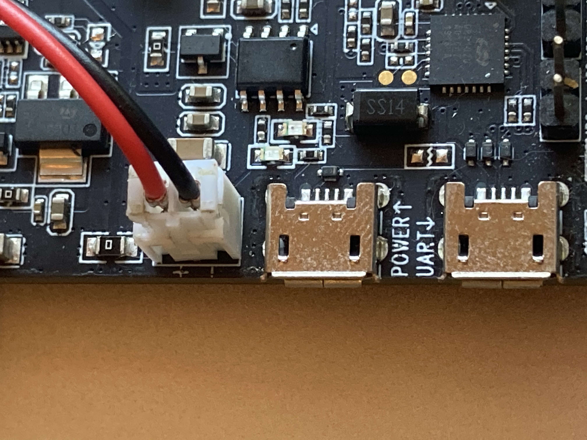
4. Place the battery somewhere. If you use the battery like we tested, you will be able to find some area between LyraT board and daughter board. Battery may get some pressure, but little pressure should be fine. (For extra safety, You may want to make a battery holder)
5. Put the daughter board back. Probably you cannot screw nuts to the end, you need to make extra space for the battery. Do not overtight the nuts.

### Button Adjustment

After the battery installation, you need to perform button voltage calibration, otherwise button recognition could be incorrect.

1. Power the board (Connect USB cable to POWER port).  We want to measure when the voltage is full, so USB cable connection is necessary.
2. Press "MODE" button on the daughter board and keep pressing it, and press RST button to restart the board. The synth will indicate "BTN ADJ MODE".
2. A few seconds later, it says "Press BTN :1" . 
3. Keep pressing button 1 until the message changes to "Press BTN:2"
4. Keep pressing button 2  until the message changes to "Press BTN:3"
5. Continue the same procedure to the end. "MODE" button means MODE button on the daughter board.
6. At the end, "Saved" message is shown. Reset the board.
7. Check all buttons on the daughter board (Ply:Seq On/Off mode is good for the checking)

### Operations 

- If you connect USB cable to POWER  socket, battery start charging. When the charge is done, LED color on the LyraT board becomes green.
- To power off the board, press "Mode" button on Lyrat Board more than 4 seconds. It will go sleep mode. OLED will be turned off but still you see the red LED. With 2000mAh battery, it will last about a week in sleep mode. 
- If you want complete shutdown, you need to make JST PT switch. https://learn.adafruit.com/on-slash-off-switches/overview
- Please reset the board when you change power source. Otherwise buttons will be malfunction.
- After the button calibration, battery indicator will be shown at the top-right corner. This is just rough battery estimate.
- If you want to go back non-battery configuration, please recalibrate the button one more time.
- You can get extra hours by turning off BLE MIDI. To disable BLE MIDI, press Play button more than 4 seconds. Result message will be shown in the screen. Reset the device. The change will be applied after the reset.


## Supported MIDI Control numbers

The QUN synth was initially designed as a sound module without any user interface, because of this, all tone-related parameters can be controlled by MIDI CC signal.

A set of MIDI CC signal can be used as preset save data. Press "Rec" button to dump MIDI CC messages.
If the synth enters an undesirable state, you can use the ESP32-LyraT's "Mode" button (next to Rec button) to toggle MIDI receiving status. This can be used as a "Panic" button.

Here are some special commands available through MIDI:
* Program change will load a preset. Through UI, 32 presets can be accessed through UI, but actually it has 128 slots.
* For saving preset, use CC #0. It will save current preset to flash (0-127). 

If you want to control parameters by your MIDI keyboard, use the chart below to check the CC number.
Or, you can see the CC# in the screen at the top of the parameter name.
Assigned CC# can be override temporary.

When you change CC parameters through MIDI keyboard or any other devices, the changed parameter will be shown on the display in real-time, you will see what you are changing, the value and mode names just like when you change parameters directly on the QUN.

Suggested MIDI CC parameters to be assigned if your MIDI keyboard has some knobs:

- MIX: (92) 
- FM: (33)
- Cutoff: (22)
- Resonance: (91)
- LFO Tune: (24)
- VCF Volume: (90)


```
0                            "Save Preset", //0x0
1                            "Mod Wheel", //1
2                            "", //2
3                            "", //3
4                            "", //4
5                            "", //5
6                            "", //6
7                            "Volume", //7
8                            "", //8
9                            "", //9
10                            "", //a
11                            "VCF Volume", //b
12                            "", //c
13                            "", //d
14                            "", //e
15                            "", //f
                            //-----------------------0x10
16                            "", //0x0
17                            "", //1
18                            "", //2
19                            "", //3
20                            "", //4
21                            "OSC1 Tune(MSB)", //5
22                            "VCF Cutoff(MSB)", //6
23                            "OSC2 Tune(MSB)", //7
24                            "LFO Tune(MSB)", //8
25                            "ENV3/4 Attack", //9
26                            "ENV3/4 Decay", //a
27                            "ENV3/4 Sustain", //b
28                            "ENV3/4 Release", //c
29                            "GRN File Pos", //d
30                            "GRN Length", //e
31                            "GRN Speed", //f
                            //-----------------------0x20
32                            "GRN Grain", //0x0
33                            "FM", //1
34                            "Efct Feedback", //2
35                            "LFO Pulse Width", //3
36                            "OSC1 Pulse Width", //4
37                            "OSC2 Pulse Width", //5
38                            "LFO Pulse Width", //6
39                            "Efct Speed", //7
40                            "VCF Type", //8
41                            "Efct Depth", //9
42                            "Clipping", //a
43                            "", //b
44                            "Efct Type", //c
45                            "VCF OSC1 bypass SW", //d
46                            "GRN Detune", //e
47                            "GRN Mode", //f
                            //-----------------------0x30
48                            "LFO Mod Tune", //0x0
49                            "LFO Mod Width", //1
50                            "FM Algorithm", //2
51                            "FM ENV3 Conn", //3
52                            "", //4
53                            "OSC1 Tune(LSB)", //5
54                            "Cutoff(LSB)", //6
55                            "OSC2 Tune(LSB)", //7
56                            "LFO Tune(LSB)", //8
57                            "FM A Amp", // 9
58                            "FM A Freq", //a
59                            "FM B Amp", //b
60                            "FM B Freq", //c
61                            "FM C Amp", //d
62                            "FM C Freq", //e
63                            "FM D Amp", //f
                            //-----------------------0x40
64                            "", //0x0
65                            "OSC2 Mod Sel", //1
66                            "LFO Mod Sel", //2
67                            "ENV1 Inv SW", //3
68                            "OSC1 Env Sel", //4
69                            "OSC2 Env Sel", //5
70                            "ENV2 Inv SW", //6
71                            "LFO Gatesync SW", //7
72                            "FM FREQ SNAP SW", //8
73                            "OSC1 Wide Tune SW", //9
74                            "OSC2 Wide Tune SW", //a
75                            "OSC2 Octave", //b
76                            "OSC1 Octave", //c
77                            "OSC1 Keysync SW", //d
78                            "Velocity SW", //e
79                            "OSC1 LFO Tune", //f
                            //-----------------------0x50
80                            "OSC1 LFO Width", //0x0
81                            "OSC2 LFO Tune", //1
82                            "OSC2 LFO Width", //2
83                            "Mono/Duo/Polly", //3
84                            "VCF LFO Volume", //4
85                            "VCF Mod Cutoff", //5
86                            "LFO Keysplit", //6
87                            "VCF LFO cutoff", //7
88                            "OSC1 Mod Sel", //8
89                            "VCF Mod Sel", //9
90                            "VCF Volume", //a
91                            "VCF Resonance", //b
92                            "OSC Mix", //c
93                            "OSC1 Shape", //d
94                            "OSC2 Shape", //e
95                            "LFO Shape", //f
                            //-----------------------0x60
96                            "ENV1 Attack", //0x0
97                            "AUX In Gain", //1
98                            "", //2 (Won't be dumped)
99                            "", //3 (Won't be dumped)
100                            "Mod Wheel Mode", //4
101                            "", //5 (Won't be dumped)
102                            "ENV1 Decay", //6
103                            "ENV1 Sustain", //7
104                            "ENV1 Release", //8
105                            "ENV2 Attack", //9
106                            "ENV2 Decay", //a
107                            "ENV2 Sustain", //b
108                            "ENV2 Release", //c
109                            "OSC1 Mod Tune", //d
110                            "OSC1 Mod Width", //e
111                            "VCF Pole / NoLinear", //f
                            //-----------------------0x70
112                            "OSC2 Mod Tune", //0x0
113                            "OSC2 Mod Width", //1
114                            "Glide", //2
115                            "Bend Range", //3
116                            "Mod Mode", //4
117                            "VCF Keysync", //5
118                            "Voice Number", //6
119                            "LFO Sync SW", //7
120                            "All Notes Off", //8
121                            "", //9
122                            "", //a
123                            "All Notes Off", //b
124                            "", //c
125                            "", //d
126                            "", //e
127                            "" //f
```
## Quick Setup with Third-party Software & Hardware
The QUN synth can be setup quickly for use with third-party software and hardware by downloading the appropriate configuration file from [Configurations](./configurations). The following configurations files are currently available:

* Native Instruments Maschine
* Native Instruments Komplete Kontrol
