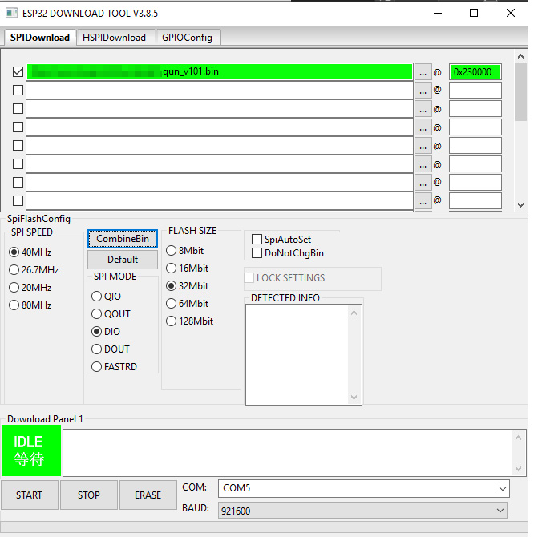

# Firmware

There are two ways to update firmware.
One is using Flash download tool. This is easier option for most of people, but works only on Windows.
Another option is using esptool.py. It will be a bit more advanced, but it should not be hard.


## Steps to update by using Flash download tool (Windows only)
 
**For Windows user: This video might be helpful to understand. https://www.youtube.com/watch?v=GGn-agl8hng (Japanese) **

1. Download and install CP210X driver. https://www.silabs.com/products/development-tools/software/usb-to-uart-bridge-vcp-drivers
 2. Download Flash download tool https://www.espressif.com/en/support/download/other-tools
 3. Connect USB cable to ESP32-LyraT's (the base board) "UART" port. Disconnect all MIDI connections. You still need the USB cable for POWER port, it means two cables need to be connected. 
 4. Open Device Manager and check your USB Serial port name. You can locate it under 'Ports (COM & LPT)', and it should read similarly to 'Silicon Labs CP210x USB to UART Bridge' followed by your port number in brackets.
 5. Download the firmware from here.
 6. Press "Boot" button and "RST" button on the ESP32-LyraT board, keep pressing it, then release "RST" button only, then release "Boot" button. Now it should be firmware uploading mode. (There is no UI feedback or indication)
 7. Run the 'flash_download_tool_x.x.x.exe' file, your version number will be in place of the 'x'.
 8. Select Developer Mode.
 9. Select ESP32 DownloadTool.
 10. Follow the screenshot for the parameters.
 
 11. Choose the '…' button to select the firmware file that you downloaded.
 12. 0x230000 is a very important number, it is the starting address of the firmware. Do **NOT** put any other numbers in the field.
 13. Make sure that the checkbox to the left of the firmware file path is ticked and that the whole horizontal row is highlighted green, otherwise whilst you may establish successful sync with the ESP32-LyraT, the firmware will not be flashed.
 14. Be sure to enter your USB Serial port name into the COM field.
 15. Press the 'START' button under the status area to flash the firmware. 
 16. Press "RST" button to reboot the board. You should be able to see firmware version in the booting message.

```
QUN V1.01
```


## Steps to update by using esptool.py (Mac OS X, Linux, or Windows)

**For OS X user: This video might be helpful to understand. https://youtu.be/gtFntynAsYw **

1. Download and install CP210X driver. https://www.silabs.com/products/development-tools/software/usb-to-uart-bridge-vcp-drivers
2. Install [esptool.py](https://github.com/espressif/esptool). You may need to install Python as well. There are several ways to install the software, but the most less confusing way is using Homebrew(https://brew.sh/) for OS X. Open the Terminal app, then put the following command.
```
$ /bin/bash -c "$(curl -fsSL https://raw.githubusercontent.com/Homebrew/install/master/install.sh)"

(It asks to input your password)

....

$ brew install esptool

...
```

3. Connect USB cable to ESP32-LyraT's (base board's) "UART" port. Disconnect all MIDI connections. You still need the USB cable for POWER port, **it means two cables need to be connected**. 

4. Open Terminal and check your USB Serial port name.  For example, `/dev/cu.SLAB_USBtoUART` . For Linux, something like `/dev/ttyUSB0`. For Windows, something like `COM4`. You can confirm the port is available by the following command on Mac OS X:

```
$ ls /dev/cu.*
$ ls /dev/tty.*
```


# Factory presets

Here is the steps to install factory presets.

1. Update the firmware to the latest (2.10 and later).
2. Download qun_factory_preset.bin and install.
3. Boot the device. "Imported" message will be shown.
4. Reinstall the latest firmware (v2.10 and later)

To switch to factory preset banks, in the load1 to 4 mode, press "Rec" on the base board.


# Release history


## v2.31

- Slightly better MIDI latency
- EG behavior change, the curve is closer to analog envelope generator, it's suitable for filter modulation.

## v2.30 (Beta)

- Sound quality improved from 44.1kHz to 48kHz. (Floating point is used for internal calculation). This might cause some behavior changes.
- Send and Return function added. When the mode is ON, signal before Envelope generator from OSC1 can be captured through Right output, and will be returned back to AUX R. Returned signal will be processed as OSC1.
- Fixed some issues with MIDI learning.
- Granular logic was improved, more snappy response, more possibilty to get usable result. It can be used as kind of wavetable synth when you set very short length with one grain.

### v2.20

- A bug fix of Pulth Width mod behavior modulated by freq1/freq2.
- Note on for note zero will be ignored (Keystep Pro sends the message for some reason)

### v2.11

- A bug fix : System crash with precise value adjustment.
- Catch value indicator: Dial value adjustment is disable when you do precise value adjustment by "Rec" and "Mode" button. However, if you turn the dial, "*" character will be indicated when the current value matches the knob value. It can be used as "Catch" mode to prevent value jumping.


### v2.10

- Some changes to configure Duo mode easier. Now MIX and OSC2 Env sel are ignored in Duo mode, those parameters are forcefully set properly for Duo Mode to avoid configuration erros. OSC1 parameters can be copied to OSC2 by long pressing button 7 in Poly/Duo mode configuration.
- MIDI learning will learn CC# and MIDI channel. It means it can learn CC# even the MIDI channel is different.
- 9th and 10th Submode such as FM Conf can be selected by "Rec" or "Mode" buttons on the base board.
- Master pan removed to improve stability
- Sound engine optimizations, including better filter response.
- Keysync (following MIDI note pitch) paramater resumed. Modulation wheel mode was deleted instead.
- Sometimes fine adjustment is hard. Now you can use "Rec" and "Mode" button to change the value by 1. To do this, keep pressing one of 8 buttons and instead of rotating dial, press "Rec" for decrease, "Mode" for increase.
- Pattern shuffle is added to sequencer. You can shuffle sequencer's playing order.

### v2.0 beta

- Looper becomes Multitrack (3 tracks) + Copy & Paste buffer
- Mixer sub-mode is added. Output can be panned (stereo). 
- Looper signal can be routed to AUX L
- Fixed arpeggiator logic
- Keysync was removed
- Sound engine optimizations

### v1.70

- Wavefolding is added (VCF/button 7), OSC1 Bypass was removed from UI.
- Mode indication becomes icon

### v1.66

- Seq tune : MIDI keyboard input result is more predictable when key is not C.

### v1.65

- Bug fix: Possible system crush when saving / loading tone.

### v1.64

- Second filter is added. It works when 2 pole filter is selected.
- Swing (shuffle) with the sequencer.

### V1.63

- Sending 14-bit MIDI internally for VCF cutoff and OSC tunes for better transition (If you have 14-bit MIDI controller it can be done by external controller as well)
- More smooth dial transition for all parameters
- You can name preset when saving.
- Indication improvements

### V1.62

- Slight change of VCF range.

### V1.61

- Fix very low frequency issue with LFO.

### v1.60

- Help message added with sticky_mode button. When you press MODE button on the dauther board, sub-mode list will be shown.
- Behavior change: Now sequencer data is paired with Tone preset.
	- Sequencer data save button (In Seq bank menu) was removed. 8 sequencer banks are available.
	- Sequencer data will be saved when preset is saved (Set:Save Bnk1-4).
	- Sequencer data will be loaded when preset is loaded (Set:Load Bnk1-4).
	- **By this change, previous saved sequencer data will be erased**.
- Sequencer count can go more than 8. When it's set more than 8, next bank will be played. (If you set it as 16 in Bank 1, then bank 1 and bank 2 will be connected)
- Sequencer bank data can be cleared(Initialized) in Seq bank menu. In Seq bank mode, press button + turn dial, it goes to COPY mode. Select "Clear" to clear the bank.
- Sequencer can start / stop from Seq bank sub mode. Play or stop by long-pressing any button of button 1 to 8.
- Sound engine won't be turned off with Granular sub-mode.
- Fixed some issues with touch buttons
- Fixed the dial linearity issue
- Fixed : 4 pole non-linear issue
- Fixed : Improved VCF bass response.

### v1.51

- Fix the typo in button adjustment mode.

### v1.50

- Some code for battery operation. Battery opertaion is still testing. The documentation will be updated when the test is finished.
- UI code was rewritten to support battery operation. It should work for most of devices, but if you experience button recognition issue, please perform Button Adjustment widzard (Check the manual for detail). If you keep having trouble, please contact info@nunomo.com
- Suspend: The device goes suspend mode by long pressing (4 sec) Mode button on LyraT board. Press RST to resume.
- BLE MIDI on/off : BLE MIDI can be turn off by long pressing "Play" button. The change will not be applied until rebooting. It will save power consumption with battery operation. 
- Bug fix: Bug fix with Running status MIDI handling. If you are experiencing MIDI input issue with MIDI clock, then it could fix the issue.

### v1.47

- New feature: Now you can step record Sequencer's tune by MIDI keyboard when you are in Seq tune mode. While you are pressing step index button 1 to 8, play note from MIDI keyboard. The note will be recorded for the step.
- Bug fix : Some bug fixes related sequencer. (Scale quantize, key shifting, BPM and others)

### v1.46beta

- Behavior change: In the sequencer mode, when note width(length) is long enough to touch next note, then it will be slurs or ties. EG will not be retriggered.

### v1.45 beta

- Bug fix: Audio record save area was overlapped.
- Time shift algorithm slightly improved.

### v1.44 beta

- Bug fix: Temporary MIDI override bug fix

### v1.43 beta

- Bug fix: Skipping SysEx message

- Bug fix: Some bugs in granular

  

### v1.42 beta

- Behavior change : Envelope generator parameter change will affect immediately. (e.g. Decay change will affect current playing note immediately. Previously the change was postponed until next trigger)
- Fixed MIDI running status decoding issue

### v1.41 beta

- Improved time stretching quality
- Small bug fixes

### v1.40 beta

It's beta. The specification in the new feature could be changed. It may have bugs.

- New feature : Temporary MIDI CC override. You can assign any MIDI CC to any parameter easily for temporary convenient control.
- New feature : Granular synthesis engine.
- Behavior change: Now MIDI channel 1 message is treated as global channel message.

### v1.32

- Line in volume fix

### v1.31

- Now the synth always receives MIDI ch 1 (take ch1 as global channel)
- Bug fix: AUX L channel fix (AUX L was AUX R)

### v1.30

- Bug fix: AUX channel was swapped. 
- Buf fix: SYNC IN was not working properly.
- New feature: You can change sequencer's bank by pressing "Rec" and "Mode" button when you are in Play mode.
- New feature: You can copy sequencer bank in Sequencer Bank sub mode. See manual for detail.

### v1.28

- Bug fix: Input volume fix with line through mode and polyphonic mode.

### v1.27

- Bug fix: Some UI malfunctions caused by v1.25 fix. Please update if you use v1.25

### v1.26

- Fixed a bug : System crashes when Effect type values set to the max(127)

### v1.25

- Fixed MIDI receiving channel bug. (Dial cannot change the value when receiving MIDI channel is more than 1)

### v1.23

- ADC button logic rollback. Update is not necessary from v1.22 unless you have issues with button recognition. 

### v1.22

- Improved stability

### v1.21

- Small performance improvement to reduce possible glitch in extreme setting
- Improved stability

### V1.20

- Non-linear filter character was changed slightly.
- Improved pulse width transition

### V1.10

- Improved filter transition response.
- ADC button logic update, affected only for specific ESP32-LyraT boards which have unusual value.

### V1.01

- Improved stability

